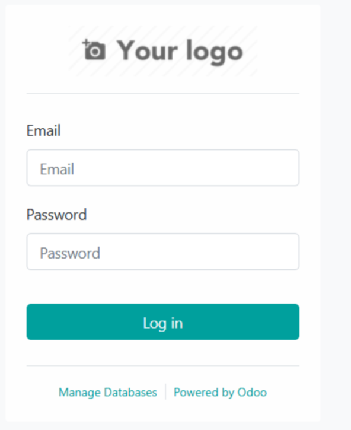
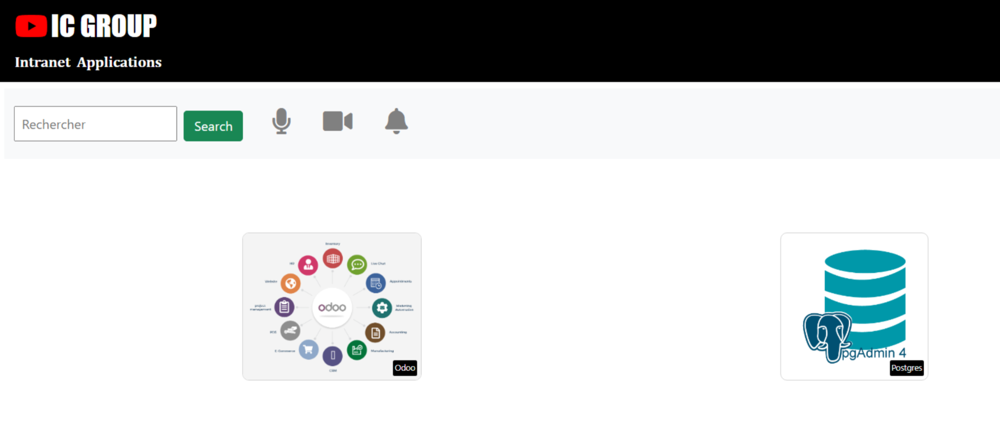

# ESGI - Alexandre SOMMER - Projet DevOps – Déploiement Odoo, pgAdmin avec Kubernetes

## Contexte
L'entreprise **IC GROUP** souhaite exposer deux applications internes à travers un site web vitrine :
- [Odoo 13.0 Community Edition](https://www.odoo.com/)
- [pgAdmin 4](https://www.pgadmin.org/)

Une application web vitrine (Flask) a été développée pour rediriger les utilisateurs vers ces deux services.

## Structure du projet
- `webapp/`: Application Flask à conteneuriser
- `k8s/`: Fichiers manifests Kubernetes
- `servers.json`: Pré-configuration de pgAdmin
- `README.md`: Guide de déploiement

---

## Étapes de déploiement

### 1. Pré-requis
- Linux VM avec :
  - Docker
  - Minikube
  - `kubectl`
- Compte Docker Hub avec image `ic-webapp:1.0` déjà poussée

---

### 2. Conteneurisation de l'application Flask

#### Dockerfile (extrait)
```Dockerfile
FROM python:3.6-alpine
WORKDIR /opt
COPY . .
RUN pip install flask
EXPOSE 8080
ENV ODOO_URL=https://www.odoo.com/
ENV PGADMIN_URL=https://www.pgadmin.org/
ENTRYPOINT ["python", "app.py"]
```

#### Build et push de l'image
```bash
docker build -t ic-webapp:1.0 .
docker tag ic-webapp:1.0 dockerhubuser/ic-webapp:1.0
docker push dockerhubuser/ic-webapp:1.0
```

---

### 3. Lancement de Minikube

```bash
minikube start
```

---

### 4. Namespace et secrets

```bash
kubectl create namespace icgroup
kubectl create secret generic odoo-secret --from-literal=password=odoo123 --namespace=icgroup
kubectl create secret generic pgadmin-secret   --from-literal=pgadmin-email=admin@icgroup.com   --from-literal=pgadmin-password=admin123 --namespace=icgroup
```

---

### 5. Configuration de pgAdmin (servers.json)

Fichier : `/pgadmin4/servers.json`
```json
{
  "Servers": {
    "1": {
      "Name": "Odoo Database",
      "Group": "Server Group 1",
      "Port": 5432,
      "Username": "postgres",
      "Host": "postgres",
      "SSLMode": "prefer",
      "MaintenanceDB": "postgres"
    }
  }
}
```

```bash
kubectl create configmap pgadmin-config   --from-file=servers.json=./servers.json   -n icgroup
```

---

### 6. Déploiement Kubernetes

Créer les fichiers suivants dans le dossier `k8s/` :

- `postgres.yaml`: Déploiement/PostgreSQL + PVC
- `odoo.yaml`: Déploiement Odoo + Service
- `pgadmin.yaml`: Déploiement pgAdmin + Service + volume pour `servers.json`
- `webapp.yaml`: Déploiement Flask + Service
- `pvc.yaml`: Volumes persistants

Appliquer les manifests :
```bash
kubectl apply -f k8s/ -n icgroup
```

---

### 7. Vérification

```bash
kubectl get all -n icgroup
```

Ouvrir les services avec Minikube :
```bash
minikube service webapp -n icgroup
```




---